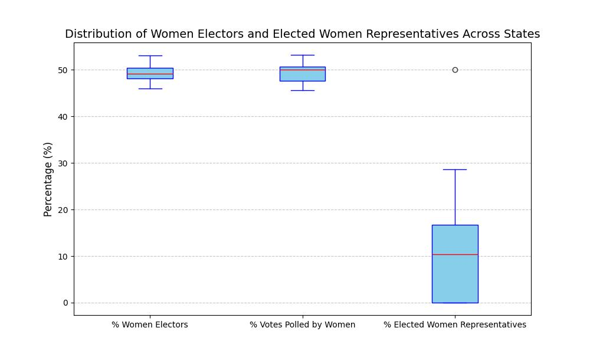
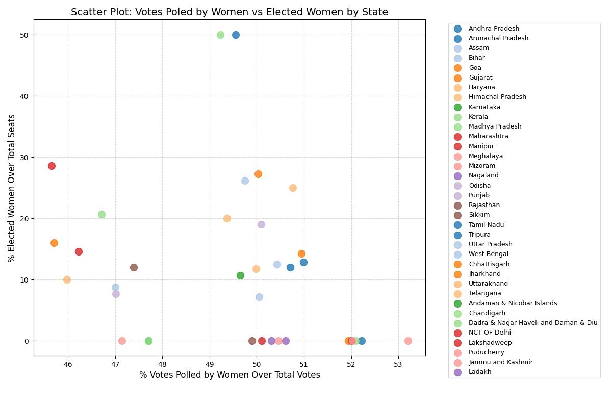

# DS200: Women's Participation in Indiam Politics

## Overview

This project analyzes women's participation in Indian politics during the 2024 General Lok Sabha elections. We have examined their participation as voters and representation as elected candidates across different states and union territories. Through this analysis, we provide insights into the relationship between the proportion of women participating in elections and the proportion of women leaders that are elected across different States and UTs.

## Data Sources

This analysis uses two datasets from the Government of India's Open Data Portal (data.gov.in):

1. **State/UTs wise participation of women electors in polls during 2024** [[Link](https://www.data.gov.in/resource/stateut-wise-participation-women-electors-polls-during-2024)]
   This dataset contains data on the participation of women as voters across Indian states and union territories in the 2024 General Lok Sabha elections.
2. **State/UTs wise participation of women candidates in poll during 2024** [[Link](https://www.data.gov.in/resource/stateuts-wise-participation-women-candidates-poll-during-2024)]
   This dataset contains data on women candidates and their electoral success across Indian states and union territories in the 2024 General Lok Sabha elections.

## Obervations and Analysis

### 1. Bar Chart: Women's Electoral Participation and Representation

- The bar chart shows percentage of women electors and percentage of votes polled by women.
- The overlaying line chart shows the percentage of elected women representatives.

**Key Findings:**

- Women electors constitute around 50% of the total electorate across almost all states
- Votes polled by women closely mirrors their proportion in the electorate
- Notable gap between women's participation as voters and their representation as elected representatives
- Only Tripura and NCT Delhi show >30% women representation in Lok Sabha seats

### 2. Box Plot: Women's Electoral Participation and Representation

- The box plots show the distribution of women electors, women's votes and elected women representatives.
  
**Key Findings:**

- Consistent distribution of women electors (48-50%) with low variance across states
- Women's voting participation mirrors electorate composition
- High variance in elected women representatives distribution
- Clear outliers showing some states perform significantly better

### 3. Scatter Plot

**Key Findings:**

- **Weak correlation** between percentage of women voters and percentage of elected women
- States with similar percentage of women voters show very different percentage of elected women representatives
- Demographic composition alone doesn't determine political representation
- Most states cluster in the lower range of elected women representatives despite gender parity in electorate

### 4. Insights and Implications

- Despite women constituting nearly half of the electorate in most states, their representation in elected positions is significantly lower, indicating structural barriers to women's political participation. 
- Increasing women's participation as voters will not automatically translate to high representation as elected officials. Targeted interventions are needed to encourage women to participate in elections as candidates.
- The analysis also reveals substantial variation in women's political representation across states. The consistency in women's proportion as electors across states reflects India's balanced gender demographic, making the representation gap more pronounced. This suggests that local factors, policies, and cultural contexts play crucial roles.

## Implementation

The code implements:

- Data cleaning and merging of two datasets
- The following visualisation techniques - bar chart, box plot and scatter plot
- Analysis of visualisations

Files in this repository:

- `/plots`: Directory containing the generated plots
- `visualisations.ipynb`: Jupyter notebook containing the visualisations
- `README.md`: This documentation file
- `index.html`: Html file for the Github Page showing the visualisations 

## Citations

1. Government of India. (2024). *State/UTs wise participation of women electors in polls during 2024*. Open Government Data (OGD) Platform India. Retrieved from https://www.data.gov.in/resource/stateut-wise-participation-women-electors-polls-during-2024
2. Government of India. (2024). *State/UTs wise participation of women candidates in poll during 2024*. Open Government Data (OGD) Platform India. Retrieved from https://www.data.gov.in/resource/stateuts-wise-participation-women-candidates-poll-during-2024
3. Election Commission of India. (2024). *General Elections 2024 - Statistical Reports*. New Delhi: Election Commission of India.

---

*This analysis was conducted as part of DS200 coursework, examining patterns in women's political participation using official government data from the 2024 Indian Lok Sabha elections.*
